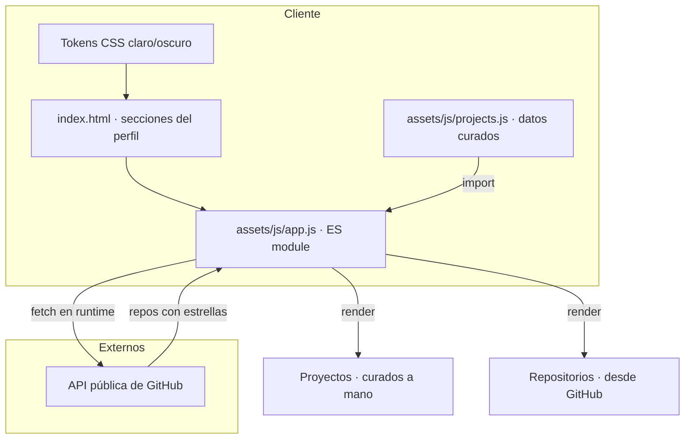
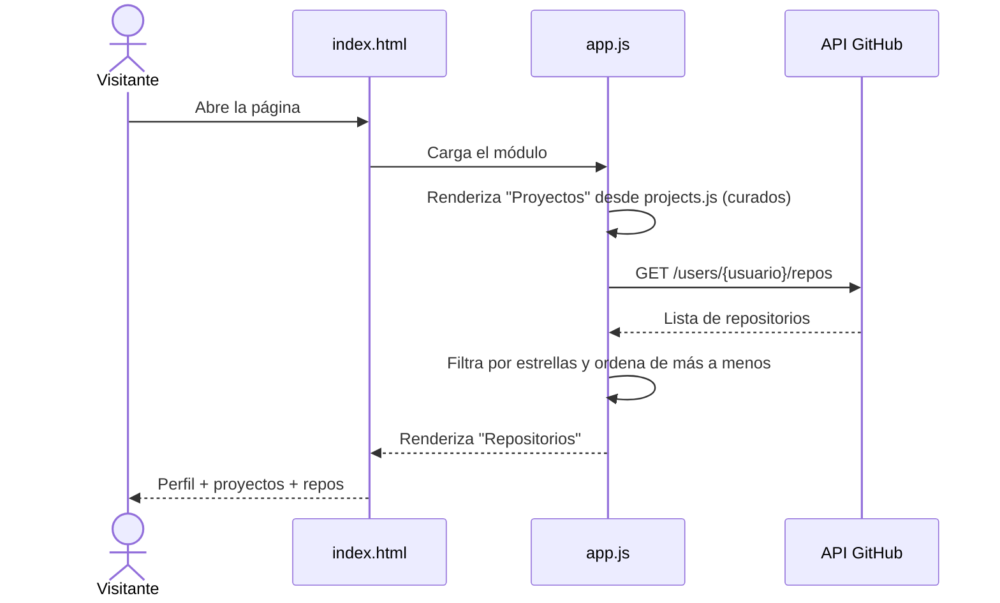

# Plantilla Portafolio Básico — Arquitectura

> Vista de alto nivel de cómo está construido el sistema y cómo se reparten las
> responsabilidades. Para el stack real (versiones, librerías) ver
> [`stack.md`](stack.md). Para el negocio ver
> [`../product/business-model.md`](../product/business-model.md).
>
> **Última actualización**: 2026-07-02

## Diagrama

## Componentes

| Componente        | Responsabilidad                                                                       | Tecnología             |
| ----------------- | ------------------------------------------------------------------------------------- | ---------------------- |
| `index.html`         | Renderiza las secciones del perfil (inicio, sobre mí, experiencia, educación, habilidades, proyectos, repositorios) | HTML5                  |
| Hoja de estilos      | Define los tokens de color y el layout; aplica tema claro/oscuro vía `data-theme`  | CSS3 con variables     |
| `assets/js/projects.js` | Lista **curada a mano** de proyectos (título, descripción, enlaces)             | Datos (ES module)      |
| `assets/js/app.js`   | Importa los proyectos y consulta la API de GitHub; renderiza ambas secciones       | JavaScript (ES module) |
| GitHub REST API      | Fuente de datos externa de los repositorios del usuario                            | Servicio público       |

## Decisiones clave

| Decisión                                       | Razón                                                          |
| ---------------------------------------------- | -------------------------------------------------------------- |
| Sitio estático sin backend                     | Cero infraestructura; deploy gratuito en GitHub Pages          |
| API pública de GitHub sin token                | Sin secretos; 60 req/hora bastan para el uso previsto          |
| Sigue siendo una plantilla configurable        | El usuario de GitHub y parte del contenido personal son placeholders editables |
| Tokens de color replicando brayandiazc.com     | Consistencia con la identidad de marca personal                |

> El detalle y las alternativas de cada decisión relevante se registran como
> ADRs en [`../decisions/`](../decisions/README.md).

## Reglas no negociables

- No hay backend ni base de datos: toda la lógica vive en el navegador.
- No se introducen secretos ni tokens; solo se usa la API pública de GitHub.
- El proyecto debe poder clonarse y abrirse sin paso de build.

## Flujos principales

Los **Proyectos** son una lista curada a mano en `assets/js/projects.js` (título,
descripción y enlaces). Los **Repositorios** se traen de GitHub, filtrados a los que
tienen estrellas (sin forks ni archivados) y ordenados de más a menos.

## Referencias

- [`stack.md`](stack.md) — stack tecnológico y versiones.
- [`design.md`](design.md) — diseño visual, temas y tokens.
- [`../conventions/`](../conventions/README.md) — convenciones de trabajo.
